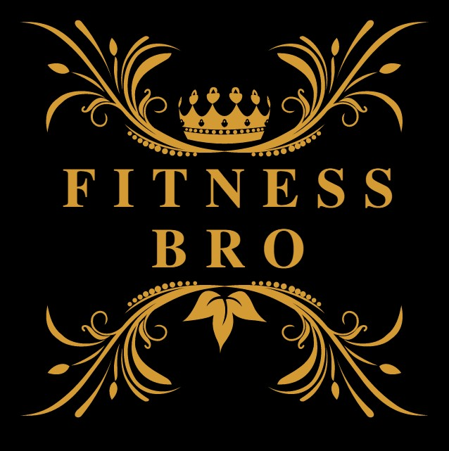
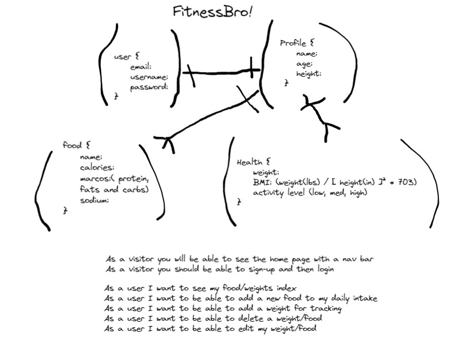
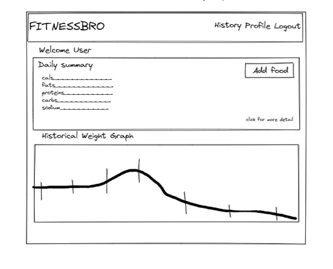
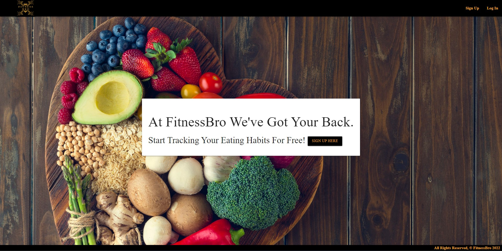
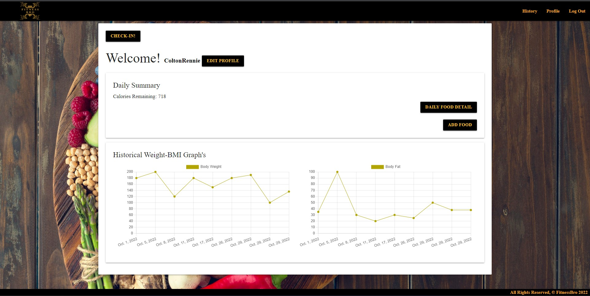

 

  
     
     
<h1 align="center">FitnessBRO</h1>

  

    FitnessBRO is a Free Health Fitness App to help you Improve your Phycial Health!
     
    <a href="https://github.com/ColtonRennie/FitnessBro"><strong>< Explore the Docs ></strong></a>
     
    <a href="https://github.com/github_username/repo_name">View Demo</a>
    ·
    <a href="https://github.com/ColtonRennie/FitnessBro/issues">Report Bug</a>
  

<!-- TABLE OF CONTENTS -->

  <h2>Table of Contents</h2>
  <ol>
    <li>
      <a href="#about-the-project">About The Project</a>
    </li>
    <li><a href="#roadmap">Roadmap</a></li>
    <li><a href="#issues">Issues or Enhancements</a></li>
    <li><a href="#contributing">Contributing</a></li>
    <li><a href="#contact">Contact</a></li>
    <li><a href="#acknowledgments">Acknowledgments</a></li>
  </ol>

<!-- ABOUT THE PROJECT -->
## About The Project

  <h2>THE PLAN BREAKDOWN</h2>
   
  
   
  
First meeting we sit down and came up with our basic plan of how we wanted our application to connect together

  
   
  
We took our entity relationship diagram plan and mocked up a wireframe of what we wanted it to look like

  
   
  
After that we started to build - Adding the sign-up functionality and login/logout

  
   
  
After you signing in you can now add foods to your daily food tracker which also allows your to set your daily max calories - track your body weight and bmi and see it all in real-time looking at the graphs on the home page.
 

(<a href="#readme-top">back to top</a>)

### Built With

* [![trello][trello.com]][trello-url]
* [![github][github.com]][github-url]
* [![visualstudio][visualstudio.com]][visualstudio-url]
* [![python][python.org]][python-url]
* [![django][djangoproject.com]][django-url]
* [![materializecss][materializecss.com]][materializecss-url]

(<a href="#readme-top">back to top</a>)

<!-- ROADMAP -->
## Roadmap

- Add-Food-Tracker
- Add-Weight & BMI Tracker
- Add-Graph to Show Progression 
- 
## Issues or Enhancements
See the [open issues](https://github.com/ColtonRennie/FitnessBro/issues) for a full list of proposed features (and known issues).

(<a href="#readme-top">back to top</a>)

<!-- CONTRIBUTING -->
## Contributing

Contributions are what make the open source community such an amazing place to learn, inspire, and create. Any contributions you make are **greatly appreciated**.

If you have a suggestion that would make this better, please fork the repo and create a pull request. You can also simply open an issue with the tag "enhancement".
Don't forget to give the project a star! Thanks again!

1. Fork the Project
2. Create your Feature Branch (`git checkout -b feature/AmazingFeature`)
3. Commit your Changes (`git commit -m 'Add some AmazingFeature'`)
4. Push to the Branch (`git push origin feature/AmazingFeature`)
5. Open a Pull Request

(<a href="#readme-top">back to top</a>)

<!-- CONTACT -->
## Contact

Colton Rennie : [@Facebook](https://www.facebook.com/colton.rennie) --- [@Linkedin](https://www.linkedin.com/in/colton-rennie-22a907b1/) ---  Colton.Rennie@hotmail.com ---
Github Link : [https://github.com/ColtonRennie](https://github.com/ColtonRennie)

Loren Chen : [@Facebook](https://www.facebook.com/loren.chen1/) --- [@Linkedin](https://www.linkedin.com/in/loren-chen-6258b7125/) --- [@Twitter](https://twitter.com/Colton_Rennie90) --- loren840603@gmail.com

(<a href="#readme-top">back to top</a>)

<!-- ACKNOWLEDGMENTS -->
## Acknowledgments

* [GeneralAssembly](https://generalassemb.ly/)
* [Denis Dujota- Instructor @ GA](https://github.com/Dujota)

(<a href="#readme-top">back to top</a>)

[trello.com]: https://img.shields.io/badge/Trello-0052CC?style=for-the-badge&logo=trello&logoColor=white
[trello-url]: https://trello.com/
[github.com]: https://img.shields.io/badge/github-000000?style=for-the-badge&logo=github&logoColor=white
[github-url]: https://github.com/
[visualstudio.com]: https://img.shields.io/badge/visualstudiocode-007ACC?style=for-the-badge&logo=visualstudiocode&logoColor=white
[visualstudio-url]: https://code.visualstudio.com/
[materializecss.com]: https://img.shields.io/badge/materializecss-ee6e73?style=for-the-badge&logo=monster&logoColor=white
[materializecss-url]: https://materializecss.com/
[djangoproject.com]: https://img.shields.io/badge/Django-092e20?style=for-the-badge&logo=Django&logoColor=white
[django-url]: https://djangoproject.com/
[python.org]: https://img.shields.io/badge/python-3776AB?style=for-the-badge&logo=Python&logoColor=white
[python-url]: https://www.python.org/

